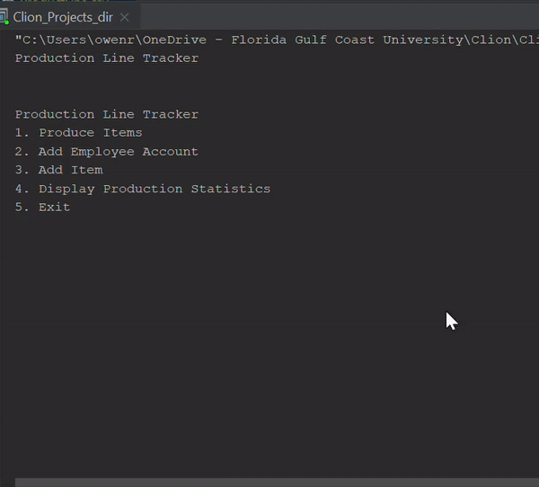

# Procedural Project
For this project I was "hired" to create software for a media player production facility that will keep track of what products are produced. This project was written independently by me the author. I wrote this project during a six week course of Programming Methodology in my junior year of college. At the time I had no prior knowledge of C++ and as you read through the project, you will see my knowledge and understanding of C++ grow considerably.

## Demonstration

## Documentation
This is the doxygen html file of my comments for the project:  

## Getting Started
Download all the files and run it on a C++ IDE.
If the productionLog.csv and ProductLine.csv files aren't downloaded, don't worry,
the program will write them itself when you call those specific functions.

## Built With
IDE used: Clion  
Other software used: Visual Studio 2017, MinGW                 
Resources used: Cave of Programming, Swebok v3

## Contributing
If you so like you can edit the program to fit your production needs. I would reccomend editting the way the serial number is printed out if you want to see more of the manufacturer's name when printing.

## Author
Owen Rose

## License
GNU GPLv3

## Acknowledgments
Web sites used: Cave of Programming, Prof. Vanselow personal website, CPlusPlus.  
Professor: Professor Vanselow

## History
I started this project with absolutely no knowledge of C++, so I was simply copying and pasting the repl.it assignments that we were doing and it was turning into a jumbled mess. So I met with my Professor and decided to scrap my entire project and start from scratch. After doing so everthing is now easily readable and works as intended.
